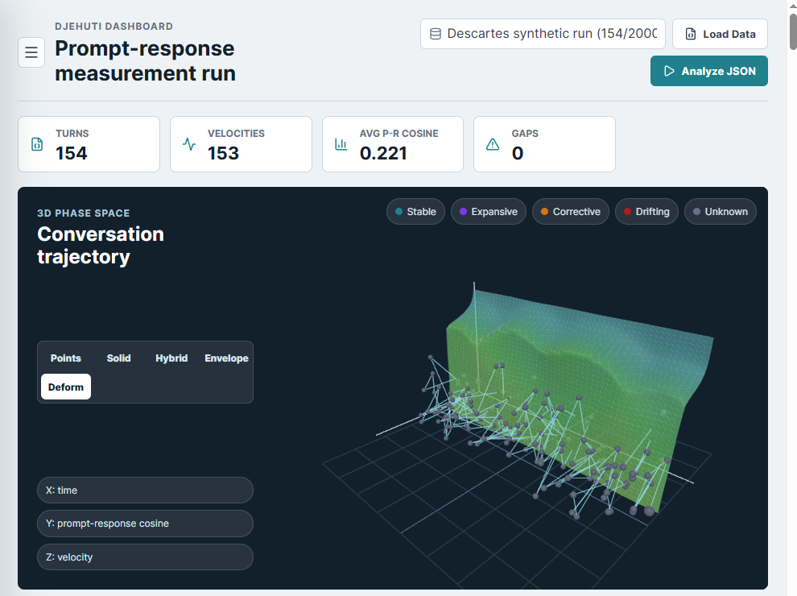
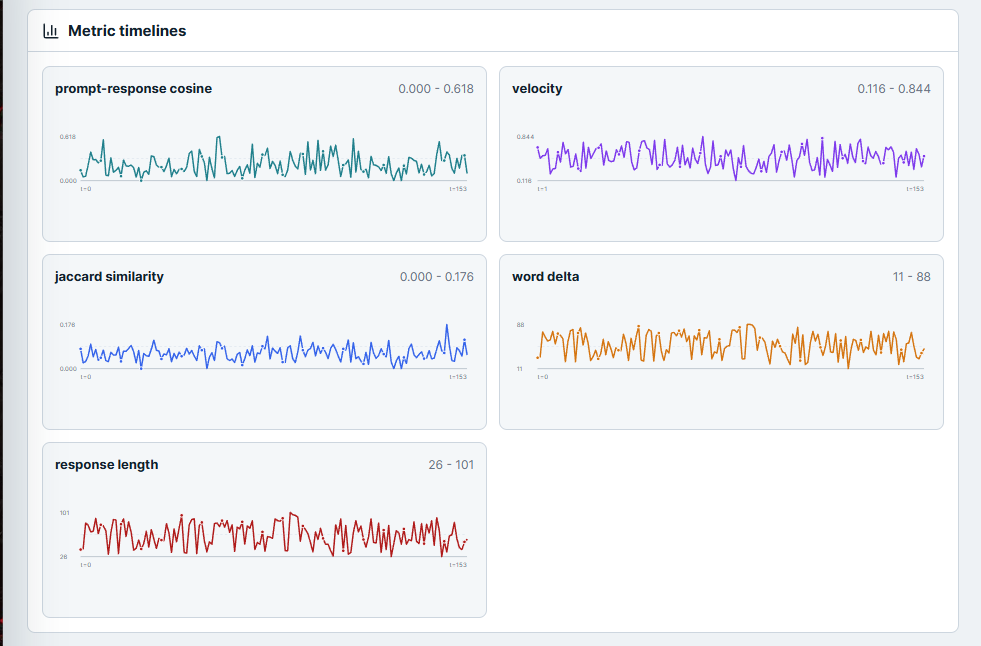
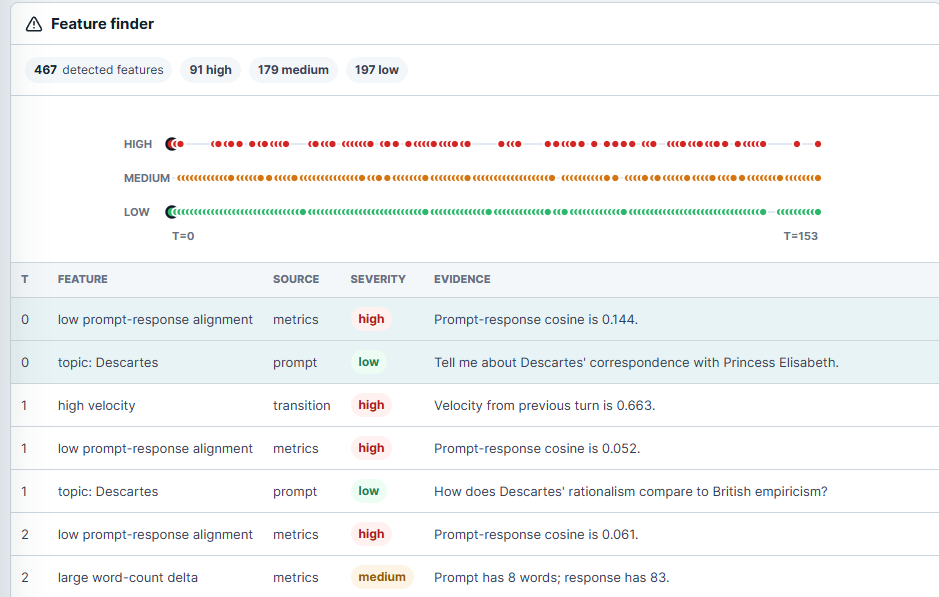

# Djehuti Cyberscope AI+

[](https://doi.org/10.5281/zenodo.20739448)
[](https://doi.org/10.5281/zenodo.20690590)

Djehuti Cyberscope AI+ is an empirical measurement workbench for studying large language model behavior in information space.

It is not an agent framework, prompt library, benchmark leaderboard, or provider wrapper. Djehuti is a protocol-oriented toolkit for recording externally observable prompt-response trajectories, applying controlled perturbations, and computing carefully labeled observables from those records.

This project implements the Information Space Dynamics (ISD) measurement framework described in Westlake (2026).

## Dashboard Preview

The current workbench includes an interactive dashboard for loading prompt-response datasets, running analysis, and inspecting the resulting trajectory.

It also includes a Live Lab page for client-side provider experiments. In Live Lab, an experimenter can enter a provider API key in the browser, start a vanilla chat with no Djehuti system context, and let Djehuti collect each completed prompt-response turn for measurement. The provider key remains in browser state and is not sent to the Djehuti API; only the captured prompt-response transcript is analyzed by the backend.



The dashboard includes metric timelines for prompt-response alignment, velocity, lexical similarity, word-count delta, and response length.



It also includes a feature finder that marks high-velocity transitions, low prompt-response alignment, structural changes, repeated prompts, and topic markers over integer logical time.

Attractor-approach diagnostics produced by the API are exported in the analysis JSON and shown as high-severity feature-finder markers with their torsional-resistance basis and kind.



## Core Principle

Djehuti follows a strict pure-observability rule:

> Every value the instrument produces must be derivable from prompt text, response text, externally exposed metadata, calibration records, and reproducible measurement protocol.

The core does not depend on model internals such as weights, activations, attention patterns, hidden sampling state, or provider-private runtime details.

## What Djehuti Measures

Djehuti is intended to support observables from the ISD framework, including:

- trajectory velocity
- curvature
- torsional resistance
- zeta-4 observables
- shock-derived perturbation velocity
- effective informational mass estimates
- dissipative energy-state checks
- marginal distributions from forked replication batches
- trajectory comparisons across models

The project is still early. The current implementation establishes the domain model, ingestion path, storage abstraction, JSON interchange format, and initial measurement primitives.

## Measurement Safety

Djehuti is designed to preserve the difference between:

- direct observations
- marginal estimates
- calibrated estimates
- hypothesis-dependent quantities
- contaminated trajectories
- refused measurements

This distinction is central to the project. For example, under pure observability, a single trajectory cannot observe both a natural continuation and a shock response for the same concrete instance. Djehuti can estimate each marginal through forked replications, but it must not report a fabricated per-instance joint value.

## Current Architecture

```text
Djehuti.sln
  src/
    Djehuti.Api/
      OpenAiResponses.fs
      Program.fs
    Djehuti.Core/
      Domain.fs
      TextAnalysis.fs
      Measurement.fs
      MLMCE.fs
      Ai.fs
      Storage.fs
      Ingestion.fs
      JsonInterop.fs
  tests/
    Djehuti.Core.Tests/
      Tests.fs
```

### Domain.fs

Defines the measurement vocabulary:

- sessions
- turns
- prompts and responses
- shock trials
- forked replication batches
- calibration records
- observable vectors
- measured values
- provenance and assumption flags

### TextAnalysis.fs

Provides low-level text decomposition and comparison metrics:

- words, sentences, lines, and frequencies
- lexical diversity
- Jaccard similarity
- cosine similarity over word frequencies
- normalized edit similarity

### Measurement.fs

Contains initial protocol-level calculations:

- response-distance velocity
- perturbation velocity
- effective mass proxy
- Window Inequality feasibility check
- marginal summaries
- energy state calculation
- dissipation checks
- measured and estimated torsional resistance helpers
- attractor-approach diagnostic events

### MLMCE.fs

Defines the Multi-LLM Moderated Conversation Engine data model:

- participant identifiers, model identifiers, and role labels
- sequential, prompted, and broadcast turn-taking modes
- MLMCE session configuration with seed prompt and intervention thresholds
- participant turns that preserve source participant and moderator-intervention state
- moderator events with trigger condition, shock prompt, target participant, thresholds, and observable vector context
- interferometer batches and pairwise `Delta Psi` matrix construction

### Ai.fs

Defines provider-neutral AI connection abstractions and the embedded Djehuti analyst boundary:

- generic AI message, request, response, and connection error types
- `IAiConnection` for provider adapters
- versioned analyst initialization profile for Djehuti Cyberscope AI+
- compact ISD/Djehuti formalism supplied to the analyst before each request
- theory-rationale notes that preserve the pure-observability interpretation of the math
- answer-discipline rules for evidence labels, refusal status, and hypothesis-dependent values
- analysis-context packaging for turns, observable vectors, reports, warnings, constants, and attractor events
- framework-grounded analyst prompting that preserves Djehuti measurement semantics
- `IDjehutiAnalyst` for an app-embedded AI assistant that can help interpret analysis results

### Djehuti.Api/OpenAiResponses.fs

Implements the first concrete AI adapter for the embedded analyst:

- backend-only OpenAI Responses API connection
- `OPENAI_API_KEY` environment-variable configuration
- optional `DJEHUTI_ANALYST_MODEL` override
- low-temperature analyst requests through the core `IAiConnection` boundary

### Storage.fs

Defines a storage monad and persistence ports:

```text
StorageContext -> Async<Result<'a, DjehutiError>>
```

This lets protocol code compose storage operations without committing the core to a specific database. An in-memory adapter is included for tests and early development.

### Ingestion.fs

Defines how observations enter the system.

Djehuti expects an ordered stream of observations using integer logical time:

```text
t = 0, 1, 2, 3, ...
```

Wall-clock timestamps are optional metadata. The formal trajectory coordinate is the sequence index.

### JsonInterop.fs

Provides the first concrete scientific interchange format:

- JSON dataset reader
- JSON dataset writer
- JSON-backed data source
- constants/config object support

Example JSON shape:

```json
{
  "source": {
    "id": "example-source",
    "kind": "replay-file",
    "name": "example replay"
  },
  "constants": {
    "distanceMetric": "cosine",
    "epsilon": 0.01
  },
  "interactions": [
    {
      "sessionId": "session-1",
      "modelId": "model-a",
      "sequenceIndex": 0,
      "prompt": "Define entropy.",
      "response": "Entropy measures uncertainty."
    }
  ]
}
```

## Build And Test

Requirements:

- .NET 9 SDK

Run tests:

```bash
dotnet test Djehuti.sln
```

## Status

Implemented so far:

- F#/.NET solution
- domain model for ISD measurement records
- text decomposition and basic comparison metrics
- measurement basis and provenance model
- calibration record shape
- calibration helpers for noise floor, local validity, token granularity, and Window Inequality decisions
- observable vector construction for turn-level measurement records
- typed marginal estimates that avoid fabricated joint pairings
- forked replication planning with calibration-gated shock trial plans
- forked replication aggregation that reports independent marginals without per-instance joint synthesis
- MLMCE session, participant-turn, moderator-event, and interferometer-batch model
- `Seed` sampling strategy for first-class seed prompt observations
- pairwise MLMCE interferometer `Delta Psi` matrix helpers with divergence flags
- provider-agnostic prompt execution ports
- provider-neutral AI connection abstraction
- embedded Djehuti analyst boundary grounded in ISD and app analysis context
- versioned embedded analyst initialization profile with strict analytic behavior, compact formalism, theory rationale, and answer discipline
- OpenAI Responses API adapter for the embedded analyst
- `/api/analyst/ask` endpoint for framework-grounded analysis questions
- dashboard Analyst AI panel that sends current-run questions to the embedded analyst and displays answers with evidence items
- dashboard Live Lab for client-side vanilla provider chats, prompt-response capture, incremental analysis, and warning logs
- minimal token-edit shock construction
- shock execution boundary with executed/refused/failed results
- full forked replication runner from plan to executable results
- trajectory geometry helpers for discrete curvature and Hermite interpolation
- zeta4 and formal identity diagnostic scaffolding with hypothesis flags
- torsional resistance helpers for measured escape thresholds and hypothesis-marked estimates
- attractor-approach detection from stability-margin and torsional-accumulation thresholds
- refusal-aware energy computation
- Delta Psi comparison across shared observable components
- structured measurement report items carrying basis, assumptions, sources, and refusal status
- storage monad and in-memory storage adapter
- provider-neutral ingestion event boundary
- JSON reader/writer and JSON-backed data source
- HTTP API and React dashboard for interactive analysis
- analysis JSON export of detected attractor events
- dashboard feature-finder markers for attractor-approach events
- xUnit test suite

Known near-term work:

- strengthen calibration precondition checks
- remove metadata-string dependence from marginal natural velocity estimation
- broaden refusal checks across all derived protocol calculations
- resolve state-transition comparison support
- add structured reporting/export
- add persistent database-backed attractor event storage
- add dedicated attractor-event dashboard review surfaces
- add additional AI provider adapters outside the core
- add persistent analyst conversations and richer analyst permission controls
- add more live-provider protocols and browser-compatible connection options

## Contributing

Contributions that advance Djehuti's measurement capabilities, visualizations, or tooling are welcome.

See the wiki for full details:

- [Contributing Guide](https://github.com/wwestlake/djehuti/wiki/Contributing) — setup, what we accept, code style
- [Branching Strategy](https://github.com/wwestlake/djehuti/wiki/Branching-Strategy) — branch naming, the `develop` → `main` release flow, hotfix process
- [Pull Request Guidelines](https://github.com/wwestlake/djehuti/wiki/Pull-Request-Guidelines) — PR title format, body template, review process

All work targets the `develop` branch. Releases to production are gated by a PR into `main`.

## License

See [LICENSE](LICENSE).
